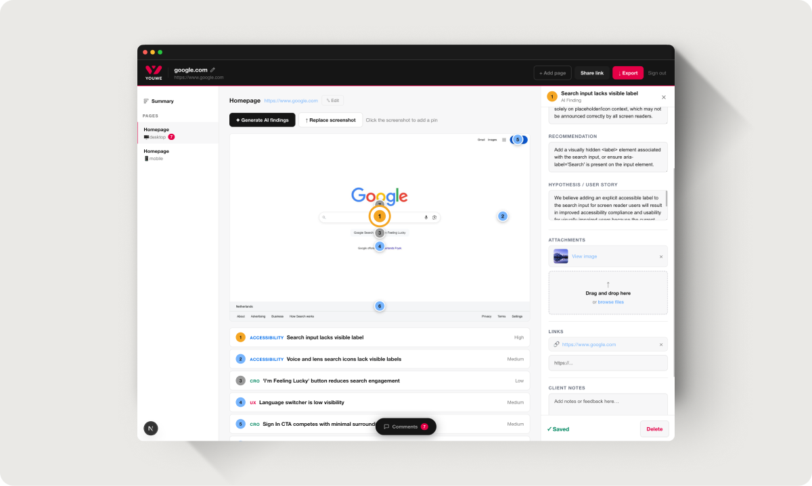

# Youwe Annotate

Internal Youwe Agency tool for auditing client websites. Paste a client URL, capture a desktop + mobile screenshot, add further pages manually, and use Claude's vision API to generate UX / Accessibility / CRO / Performance / Conversion findings pinned directly on the screenshot. Findings are compiled into a shareable, client-facing report.



## Tech stack

- [Next.js](https://nextjs.org) (App Router) + React + TypeScript
- [Tailwind CSS v4](https://tailwindcss.com)
- [Puppeteer](https://pptr.dev) (`puppeteer-core` + `@sparticuz/chromium`) for screenshot capture
- [Vercel Blob](https://vercel.com/docs/storage/vercel-blob) for report/screenshot storage
- [Anthropic API](https://docs.anthropic.com) (`claude-sonnet-4-6`) for vision-based finding generation

## Prerequisites

- Node.js 20+
- npm, pnpm, yarn, or bun

## Getting started

1. Install dependencies:

   ```bash
   npm install
   # or pnpm install / yarn install / bun install
   ```

2. Create a `.env.local` file in the repo root with the following variables:

   | Variable | Description |
   |---|---|
   | `ANTHROPIC_API_KEY` | Anthropic API key used for AI finding/overview generation |
   | `AUDIT_PASSWORD` | Master/admin password — sees and manages all clients and reports |
   | `BLOB_READ_WRITE_TOKEN` | Vercel Blob read/write token for report and screenshot storage |

   Get actual values from a teammate through a secure channel — never via git.

3. Run the development server:

   ```bash
   npm run dev
   ```

4. Open [http://localhost:3000](http://localhost:3000).

Individual client passwords are created and reset in-app under "Manage clients" (admin only), not via environment variables.

## Scripts

| Command | Description |
|---|---|
| `npm run dev` | Start the development server |
| `npm run build` | Create a production build |
| `npm run start` | Start the production server (after `build`) |

## Deployment

Hosted on [Vercel](https://vercel.com), which also provides the Blob storage in use. The repo lives on Youwe's GitHub Enterprise instance, which Vercel's GitHub integration does not support — there is **no auto-deploy on push**. Deploy manually from the repo root:

```bash
npx vercel --prod --yes
```

Each Vercel project needs the same three environment variables set. Multiple team members' deployments currently share one Blob store and one Anthropic API key.

## Project structure

See [AGENTS.md](./AGENTS.md) for a detailed map of key files, conventions, and architectural notes (auth model, capture pipeline, report data flow, etc.) — it doubles as the project's contributor documentation.

## Learn more

- [Next.js Documentation](https://nextjs.org/docs)
- [Vercel Blob Documentation](https://vercel.com/docs/storage/vercel-blob)
- [Anthropic API Documentation](https://docs.anthropic.com)
